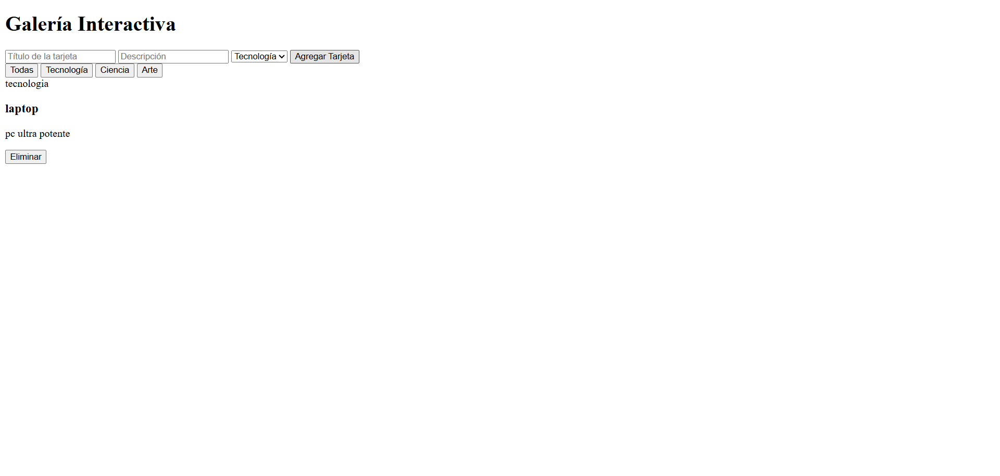
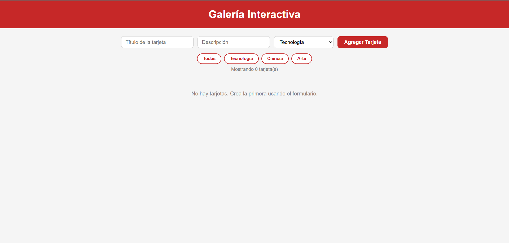

# Galería Interactiva — William Balaguera

## Descripción
Galería interactiva de tarjetas desarrollada como laboratorio de la
Unidad 4 del curso de Programación Web. Implementa manipulación del
DOM, modelo de eventos con delegación, y características de ES6 como
arrow functions, template literals y desestructuración.

## Tecnologías utilizadas
- HTML5 semántico
- CSS3 con Custom Properties y CSS Grid
- JavaScript ES6 puro (sin librerías externas)

## Funcionalidades
- Agregar tarjetas con título, descripción y categoría
- Eliminar tarjetas con delegación de eventos
- Filtrar tarjetas por categoría
- Contador de tarjetas visibles
- Mensaje de galería vacía

## Cómo ejecutar
1. Clonar: `git clone https://github.com/WilliamBalaguera/balaguera-post1-u4`
2. Abrir en VS Code → clic derecho en index.html → Open with Live Server
3. Navegar a `http://localhost:5500`

## Capturas de pantalla

[chekpoint 2](img/image-1.png)

